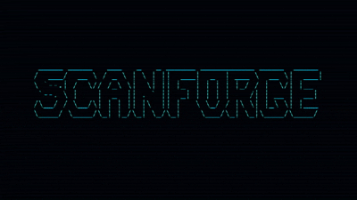

<p align="center">
  
</p>

# ScanForge

**ScanForge** est un outil en ligne de commande (CLI) écrit en Go, conçu pour orchestrer de manière sécurisée et structurée vos flux de travail de test d'intrusion et de reconnaissance (recon).

Grâce à son architecture pilotée par les artefacts, ScanForge enchaîne intelligemment les outils de sécurité reconnus du marché tout en appliquant des règles de validation de scope extrêmement strictes pour éviter tout scan non autorisé.

## 🚀 Fonctionnalités Clés

- **Pipeline orienté Artefacts** : Les modules communiquent via des artefacts de manière ordonnée (ex: la sortie de `subfinder` alimente automatiquement `dnsx` et `httpx`).
- **Validation de Scope Stricte** : Impossible de scanner un domaine ou une IP qui ne figure pas explicitement dans votre fichier de scope (`scope.txt`).
- **Mode Dry-Run** : Visualisez les commandes qui vont être lancées et les fichiers générés avant de faire la moindre requête réseau.
- **Outil de Diagnostic (Doctor)** : Vérifiez instantanément si vos dépendances locales sont installées et configurées pour le profil sélectionné.
- **Rapports consolidés** : Génère automatiquement un modèle de risque unifié en formats `report.json` et `report.md`.

---

## 🛠️ Outils Supportés

ScanForge centralise et orchestre 10 outils de sécurité indispensables :

1. **subfinder** (Découverte de sous-domaines)
2. **dnsx** (Résolution DNS active)
3. **httpx** (Sondage HTTP et détection de technologies)
4. **naabu** (Scanner de ports ultra-rapide)
5. **nmap** (Scan de ports et détection de services précis)
6. **whatweb** (Reconnaissance des technologies web)
7. **wafw00f** (Détection de Web Application Firewall)
8. **katana** (Crawl de ressources web)
9. **ffuf** (Fuzzing de répertoires et fichiers)
10. **nuclei** (Scanner de vulnérabilités basé sur des modèles)

---

## 📦 Installation Simple (Sans prise de tête)

ScanForge dépend d'outils externes. Nous avons automatisé leur installation pour vous faciliter la vie.

### Option 1 : Scripts automatisés (Recommandé)

**Sur Windows (PowerShell) :**
Lisez et exécutez le script d'installation pour configurer l'environnement :

```powershell
.\install.ps1
```

**Sur Linux / macOS (Bash) :**

```bash
chmod +x install.sh
./install.sh
```

### Option 2 : Docker (Zéro installation locale)

Si vous ne souhaitez pas installer Go ou les autres outils sur votre système hôte, utilisez Docker. Tout est pré-configuré dans l'image !

```bash
# Avec docker-compose
docker-compose run scanforge run target.com --profile web

# Manuellement avec Docker
docker build -t scanforge .
docker run -v $(pwd):/workspace scanforge run target.com --profile web
```

---

## 🚦 Guide de Démarrage Rapide

### 1. Initialiser le projet

Générez les fichiers de configuration par défaut dans votre répertoire actuel :

```bash
scanforge init
```

Cela crée :

- `scanforge.yaml` : Permet de configurer les chemins des outils et de modifier/définir des profils.
- `scope.txt` : Fichier de scope obligatoire où vous devez lister vos cibles autorisées (ex: `example.com`, `*.example.com`, `192.168.1.0/24`).

### 2. Valider l'environnement

Vérifiez que tous les outils requis pour votre profil de scan sont bien installés et accessibles :

```bash
scanforge doctor --profile web
```

### 3. Lancer un Scan

Assurez-vous que votre cible est autorisée dans `scope.txt`, puis lancez :

```bash
scanforge run example.com --profile web
```

Pour tester sans envoyer de requêtes :

```bash
scanforge run example.com --profile web --dry-run
```

---

## 📊 Profils de Scan Intégrés

| Profil    | Outils inclus                                                          | Description                                                        |
| --------- | ---------------------------------------------------------------------- | ------------------------------------------------------------------ |
| `passive` | `subfinder`, `dnsx`, `httpx`                                           | Reconnaissance passive et sondage HTTP de base.                    |
| `ports`   | `subfinder`, `dnsx`, `naabu`, `nmap`                                   | Cartographie des ports ouverts et détection de services.           |
| `web`     | `subfinder`, `dnsx`, `httpx`, `whatweb`, `wafw00f`, `katana`, `nuclei` | Analyse applicative complète, crawling et scan de vulnérabilités.  |
| `full`    | **Tous les outils**                                                    | Suite complète de reconnaissance, fuzzing et détection de failles. |

---

## 📂 Structure du Rapport Final

À la fin de chaque scan, un dossier horodaté est créé sous `./runs/`. En plus des fichiers de logs bruts de chaque outil, ScanForge génère :

- `report.json` : Modèle de données structuré regroupant les actifs, ports ouverts, technologies détectées et vulnérabilités trouvées.
- `report.md` : Rapport humainement lisible et synthétisé du scan.
- `manifest.json` : Suivi complet de l'exécution (statut de chaque outil, durée, commande exacte lancée).
