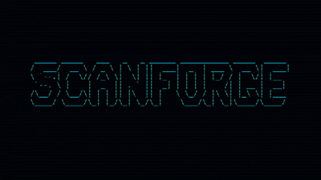

# README（简体中文）

<p align="center">
  
</p>

# ScanForge

> **English**：[英文文档](../../README.md) · **Français**：[法语文档](../fr/README.md)

**ScanForge** 是一款用 Go 编写的命令行工具（CLI），旨在以安全、结构化的方式编排你的渗透测试和侦察（recon）工作流。

借助其以产物（artifact）为驱动的架构，ScanForge 智能地串联业界公认的安全工具，同时实施极其严格的扫描范围（scope）验证规则，防止任何未经授权的扫描。

## 📚 文档

- [使用指南](USAGE.md)：安装、配置、命令与示例。
- [范围管理](SCOPE.md)：隐式模式、文件、排除项与 CI。
- [架构](ARCHITECTURE.md)：DAG、产物、集中过滤与输出。
- [贡献指南](../AGENTS.md)：仓库结构、代码风格与验证。

## 🚀 核心特性

- **产物驱动的流水线**：模块通过产物有序通信（例如 `subfinder` 的输出自动喂给 `dnsx` 和 `httpx`），并按 DAG 波次并行执行。
- **严格的扫描范围验证**：通过文件显式指定范围，或确认隐式范围（默认为 `exact`，可请求 `domain`），然后对每个产物进行过滤。
- **代理集成（Caido / Burp Suite）**：`--proxy` 将相关模块的 HTTP 流量路由到你的拦截代理，便于手动分类/重放。
- **认证扫描**：`-H/--header`（可重复）向发出的每个 HTTP 请求注入请求头/ Cookie（会话、Bearer 令牌）。
- **JavaScript 密钥扫描器**：`jssecrets` 模块抓取爬取到的 `.js` 文件，检测泄露的 API 密钥/令牌/凭据、公共云存储桶、内网主机、邮箱、敏感 API 端点以及可访问的 source map。
- **完全可配置的 Nuclei**：通过专用参数控制严重级别、标签、速率限制、自定义模板和模板更新。
- **Nmap 并行化**：有界工作线程池（`--nmap-concurrency`），替代逐主机顺序扫描。
- **实时进度**：扫描期间每个活动模块显示 spinner（默认可见，不仅限于 `--verbose`），`plan`/`doctor` 显示彩色表格，运行结束时显示汇总面板。
- **Dry-Run 模式**：在发出任何网络请求之前，预览将要执行的命令和生成的文件。
- **诊断工具（Doctor）**：即时检查本地依赖项是否已为所选配置文件安装并配置。
- **合并报告**：自动生成统一的风险模型，输出 `report.json` 和 `report.md` 格式。

---

## 🛠️ 支持的工具

ScanForge 集中编排 12 个外部安全工具，外加 1 个内置模块：

1. **subfinder**（子域名发现）
2. **dnsx**（主动 DNS 解析）
3. **httpx**（HTTP 探测与技术识别）
4. **naabu**（超快端口扫描器）
5. **nmap**（精确的端口扫描与服务识别，并行执行）
6. **whatweb**（Web 技术指纹识别）
7. **wafw00f**（Web 应用防火墙检测）
8. **katana**（Web 资源爬取）
9. **ffuf**（目录与文件模糊测试）
10. **nuclei**（基于模板的漏洞扫描器）
11. **gau**（被动收集历史 URL）
12. **tlsx**（TLS 证书与协议增强）
13. **jssecrets**（内置，无需外部二进制）—— 分析 `katana` 爬取的 JS，检测密钥、云存储桶、内网主机、邮箱和暴露的 source map

`httpx`、`nuclei`、`katana`、`ffuf`、`whatweb`、`wafw00f`、`subfinder`、`gau` 和 `jssecrets` 支持 `--proxy` 和 `-H/--header`，可将流量路由到 Caido/Burp 并以认证模式扫描。

---

## 📦 简单安装（省心）

与主流工具（nuclei、subfinder 等）一样，ScanForge 通过 GitHub Releases 分发**预编译二进制文件**：无需编译，无需 Go。

### 方式 1：一行命令（推荐）

**Linux / macOS / Git-Bash：**

```bash
curl -fsSL https://raw.githubusercontent.com/MikeRoss27/scanforge/main/install.sh | bash
```

该脚本会检测你的操作系统/架构，下载最新版本，校验 SHA-256 校验和，并安装到 `~/.local/bin`。

**Windows（PowerShell）：**

```powershell
Invoke-Expression (Invoke-RestMethod https://raw.githubusercontent.com/MikeRoss27/scanforge/main/install.ps1)
```

安装程序将二进制放在 `%LOCALAPPDATA%\Programs\scanforge`，并自动将目录添加到用户 PATH。

**指定版本或自定义目录：**

```bash
curl -fsSL https://raw.githubusercontent.com/MikeRoss27/scanforge/main/install.sh | bash -s -- --version v0.1.0 --dir /usr/local/bin
```

### 方式 2：完整安装（二进制 + 扫描工具）

ScanForge 编排外部工具（nmap、nuclei、subfinder、httpx 等）。如需在 ScanForge 之外自动安装它们（需要 Go）：

```bash
curl -fsSL https://raw.githubusercontent.com/MikeRoss27/scanforge/main/install.sh | bash -s -- --full
```

在仓库克隆目录下，本地脚本可完成相同操作：

```bash
chmod +x install.sh && ./install.sh --full   # Linux / macOS
.\install.ps1 -Full                           # Windows (PowerShell)
```

### 方式 3：Docker（零本地安装）

如果你不想在宿主机上安装 Go 或其他工具，可以使用 Docker。镜像已预配置好一切！

```bash
# 使用 docker-compose
docker-compose run scanforge run target.com --profile web

# 手动使用 Docker
docker build -t scanforge .
docker run -v $(pwd):/workspace scanforge run target.com --profile web
```

---

## 🚦 快速入门指南

### 1. 初始化项目

在当前目录生成默认配置文件：

```bash
scanforge init
```

这将创建：

- `scanforge.yaml`：配置工具路径以及修改/定义配置文件。
- `scope.txt`：可选模板，用于保留可复用的测试范围。你可以删除它；ScanForge 随后会提出一个需要确认的最小隐式范围。

### 2. 验证环境

检查扫描配置文件所需的所有工具是否已安装并可访问：

```bash
scanforge doctor --profile web
```

### 3. 启动扫描

在没有适用的范围文件时，ScanForge 会从目标推导出最小范围，显示它并在创建运行前请求显式确认：

```bash
scanforge run example.com --profile web
```

要包含该域名及其子域名、添加规则或排除项：

```bash
scanforge run example.com --scope-mode domain \
  --scope-add api.other.test --exclude admin.example.com
```

`--scope file.txt` 保持最高优先级，如果它拒绝目标，绝不会被静默替换。为避免歧义，它不能与 `--scope-mode`、`--scope-add` 或 `--exclude` 组合使用。显式或配置的文件无需额外确认。在 CI 或无 TTY 的情况下使用隐式范围时，请先检查 `scanforge plan`，然后用 `--confirm-scope` 确认意图。

在不发送任何请求的情况下进行测试：

```bash
scanforge run example.com --profile web --dry-run --confirm-scope
```

使用隐式范围时，dry-run 同样需要确认：它不会执行网络请求，但会正式确定授权的范围。

在创建运行前预览已验证的流水线：

```bash
scanforge plan example.com --preset deep
```

`scanforge scan` 命令是 `scanforge run` 更直接的别名：

```bash
scanforge scan example.com --preset safe
```

---

## 🕵️ 代理、认证与 Nuclei 设置

在真实渗透测试中，将流量路由到 Caido（或 Burp Suite）并注入已认证的会话：

```bash
scanforge run app.example.com --profile web \
  --proxy http://127.0.0.1:8080 \
  -H "Cookie: session=..." \
  --nuclei-tags cve,exposure --nuclei-severity critical,high \
  --nuclei-update-templates \
  --nmap-concurrency 6
```

- `--proxy`：为使用 HTTP 的模块指定 HTTP/SOCKS 代理。
- `-H/--header`（可重复）：添加到每个请求的原始请求头 `"名称: 值"`。
- `--nuclei-severity`、`--nuclei-exclude-severity`、`--nuclei-tags`、`--nuclei-exclude-tags`、`--nuclei-rate-limit`、`--nuclei-templates`、`--nuclei-update-templates`：精细控制漏洞扫描器。
- `--nmap-concurrency`：并行的 nmap 扫描数（默认 4）；在敏感项目上请调低以保持低调。

---

## 📊 内置配置文件与预设

| 名称 | 模块 | 用途 |
| --- | --- | --- |
| `safe` | subfinder, dnsx, httpx, tlsx | 轻量暴露面检查。 |
| `recon` | safe + gau | 用历史 URL 丰富资产清单。 |
| `passive` | subfinder, dnsx, httpx | 最小历史流水线。 |
| `ports` | subfinder, dnsx, naabu, nmap | 开放端口，然后验证服务。 |
| `web` | subfinder, dnsx, httpx, whatweb, wafw00f, katana, jssecrets, nuclei | 应用分析，并提取 JS 密钥。 |
| `vuln` | subfinder, dnsx, httpx, tlsx, nuclei | 针对性漏洞检测。 |
| `deep` | 所有模块（+ jssecrets） | 完整且高噪音的流水线。 |
| `full` | 所有模块（+ jssecrets） | 完整配置文件，兼容历史版本。 |

`--preset safe` 和 `--profile safe` 可互换使用。在任何活动配置文件之前，请始终用 `scanforge plan` 检查其 DAG。

---

## 📂 最终报告结构

每次扫描结束后，会在 `./runs/` 下创建带时间戳的文件夹。除每个工具的原始日志外，ScanForge 还会生成：

- `report.json`：资产、端口、技术和漏洞的结构化模型。
- `report.md`：可读的简明报告。
- `00_meta/manifest.json`：运行状态、模块、产物和范围元数据。
- `00_meta/commands.log`：准备或执行的外部命令。
- `00_meta/effective-scope.txt`：实际应用范围的规范副本，其来源和模式记录在清单中。
- `00_meta/scope-rejections.jsonl`：被拒绝的范围外值（如有）。
- `06_vulns/js-secrets.jsonl`：在爬取的 JS 中检测到的密钥、云存储桶、内网主机、邮箱和 source map（`jssecrets` 模块）。

> ScanForge 只能用于你拥有明确授权的资产。
